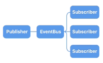

# EventBus

**EventBus** is a safe-by-default alternative to Cocoa's `NSNotificationCenter`. It provides a **type-safe API** that can **safely** be used from **multiple threads**. It automagically removes subscribers when they are deallocated.

EventBus is to **one-to-many notifications** what a `Delegate` is to one-to-one notifications.



## Usage

### Simple Notifications:

Let's say you have a lottery that's supposed to notify all its participating players every time a new winning number is drawn:

```swift
import EventBus

protocol LotteryDraw {
    func didDraw(number: Int, in: Lottery)
}

class Lottery {
    private let eventBus = EventBus()

    func add(player: LottoPlayer) {
        self.eventBus.add(subscriber: player, for: LotteryDraw.self)
    }

    func draw() {
        let winningNumber = arc4random()
        self.eventBus.notify(LotteryDraw.self) { subscriber in
            subscriber.didDraw(number: Int(winningNumber), in: self)
        }
    }
}

class LottoPlayer : LotteryDraw {
    func didDraw(number: Int, in: Lottery) {
        if number == 123456 { print("Hooray!") }
    }
}
```

### Complex Notifications:

Nice, but what if you would like to group a set of **semantically related notifications** (such as different stages of a process) into a common protocol? No problem! Your protocol can be of **arbitrary complexity**.

Consider this simple key-value-observing scenario:

```swift
import EventBus

protocol ValueChangeObserver {
    func willChangeValue(of: Publisher, from: Int, to: Int)
    func didChangeValue(of: Publisher, from: Int, to: Int)
}

class Publisher {
    private let eventBus = EventBus()

    var value: Int {
        willSet {
            self.eventBus.notify(ValueChangeObserver.self) { subscriber in
                subscriber.willChange(value: self.value, to: newValue)
            }
        }
        didSet {
            self.eventBus.notify(ValueChangeObserver.self) { subscriber in
                subscriber.didChange(value: oldValue, to: self.value)
            }
        }
    }

    func add(subscriber: ValueChangeObserver) {
        self.eventBus.add(subscriber: subscriber, for: ValueChangeObserver.self)
    }
}

class Subscriber : ValueChangeObserver {
    func willChangeValue(of: Publisher, from: Int, to: Int) {
        print("\(of) will change value from \(from) to \(to).")
    }

    func didChangeValue(of: Publisher, from: Int, to: Int) {
        print("\(of) did change value from \(from) to \(to).")
    }
}
```

### Chaining

Sometimes it is desirable to have one event bus forward a carbon copy of all of its events to a second event bus. A possible scenario would be a proxy event bus that acts as a centralized facade to an arbitrary number of internal event buses.

```swift
let proxyEventBus = EventBus()

let eventBus1 = EventBus()
let eventBus2 = EventBus()
proxyEventBus.attach(chain: eventBus1, for SomeEvent.self)
proxyEventBus.attach(chain: eventBus2, for SomeEvent.self)

let subscriber1 = …
let subscriber2 = …
eventBus1.add(subscriber: subscriber1, for: SomeEvent.self)
eventBus2.add(subscriber: subscriber2, for: SomeEvent.self)

proxyEventBus.notify(SomeEvent.self) { subscriber in
    // …
}

// subscriber1 & subscriber2 are getting notified
```

For each event notified on either `eventBus1 ` or `eventBus2` a carbon copy will be forwarded to `proxyEventBus `.

### Encapsulation

The API of EventBus is split up into these protocols:

- `EventRegistrable`
- `EventSubscribable`
- `EventChainable`
- `EventNotifiable`

This enables for ergonomic safe encapsulation …

```swift
public class Publisher {
    public var eventSubscribable: EventSubscribable {
        return self.eventBus
    }

    private let eventBus: EventBus = …

    // …
}
```

… preventing anybody else from issuing notifications on `Publisher`'s event bus.

## Debugging

As there is no way to see from the type of `EventBus` which kind of events are to be expected to be received from it, or allowed to notified on it, **EventBus** provides optional measures for catching misuse early and as an aid in general debugging.

### Debug subscription of unregistered event types:

```swift
let eventBus = EventBus(options: [.warnUnknown])
eventBus.register(forEvent: FooEvent.self)

// Needed to silence warning:
// eventBus.register(forEvent: BarEvent.self)

let subscriber = …
eventBus.add(subscriber: subscriber, for: BarEvent.self)

// Console:
// Expected event of registered type (e.g. FooEvent), found: BarEvent.
// Info: Use a "Swift Error Breakpoint" on type "EventBus.UnknownEventError" to catch.
```

### Debug notification of unregistered event types:

```swift
let eventBus = EventBus(options: [.warnUnknown])
eventBus.register(forEvent: FooEvent.self)

// Needed to silence warning:
// eventBus.register(forEvent: BarEvent.self)

eventBus.notify(FooEvent.self) { subscriber in
	// …
}

// Console:
// Expected event of registered type (e.g. FooEvent), found: BarEvent.
// Info: Use a "Swift Error Breakpoint" on type "EventBus.UnknownEventError" to catch.
```

### Debug unhandled events:

```swift
let eventBus = EventBus(options: [.warnUnhandled])

// Needed to silence warning:
// eventBus.add(subscriber: …, for: FooEvent.self)

eventBus.notify(FooEvent.self) { subscriber in
	// …
}

// Console:
// Expected event of registered type (e.g. FooEvent), found: BarEvent.
// Info: Use a "Swift Error Breakpoint" on type "EventBus.UnhandledEventError" to catch.
```

## Installation

The recommended way to add **EventBus** to your project is via [Carthage](https://github.com/Carthage/Carthage):

    github 'regexident/EventBus'

Or to add **EventBus** to your project is via [CocoaPods](https://cocoapods.org):

    pod 'Swift-EventBus'

## License

**EventBus** is available under a **MPL-2 license**. See the `LICENSE` file for more info.
